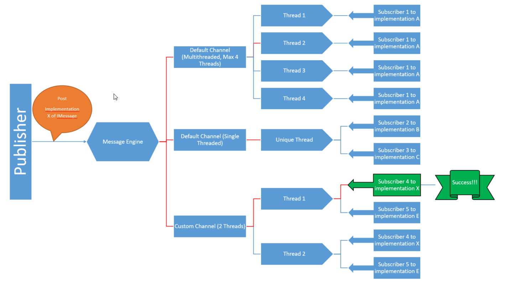

# DPN: Petri Nets con Delphi

<br/>
<div>
  <!-- Stability -->
  <a href="https://nodejs.org/api/documentation.html#documentation_stability_index">
    
  </a>
  <!-- Standard -->
  <a href="https://img.shields.io/badge">
    
  </a>
  <!-- Standard -->
  <a href="https://img.shields.io/badge">
    
  </a>
</div>
<br/>

## Otros frameworks utilizados

* Spring4D
* DUnitX
* Bus de mensajes

## Version de Delphi recomendada

10.4.1 debido a que se han resuelto problemas de las librerías parallel utilizadas en el proyecto

## Estado

* El proyecto está en sus comienzos
* Testeando las partes básicas

### Caracteristicas
* Partial High Level Petri Net
* Evolución de tokens coloreados (arrastran valores) y de tokens de sistema (no arrastran valores)
* Multiples disparos de transiciones concurrentes
* Transiciones condicionadas, hay condiciones a cumplir y acciones a ejecutar en caso de que la transición se dispare
* Arcos inhibidores y arcos de reset
* Superplazas: plazas que contienen a otras plazas y provocan una herencia de comportamientos
* Capacidad finita de la red de petri

### Pendiente (mucho)
* terminar unittesting del core: integración eventos
* ampliar core: logging, debugging, persistencia de configuracion
* capas posteriores al core

## Bus de mensajes

Es un bus de mensajes (eventos) basado en el patrón publicador/subscriptor



### Caracteristicas

* Basado en interfaces. Todos los mensajes implementan la interface **IMessage**. Lo normal es que los nuevos mensajes hereden de **TMessage**
* No se realiza clonación de los mensajes al estar basado en interfaces, ni requiere de una destrucción explícita de los mismos.
* Thread Safe
* Qué es el **canal**:
	1. equivalente a un threadpool especializado en la distribución de mensajes a los listeners
	2. puede tener 1 ó 'n' threads
	3. se identifican por un nombre
* Los **subscriptores**:
	1. se subscriben a un canal, ya sea a uno de los existentes o a uno nuevo customizado
	2. se subscriben a un tipo de mensaje (con genéricos), ya sea al tipo base o también al base y heredados (configuración)
	3. pueden filtrar los mensajes para quedarse solo con aquellos de su interés
	4. pueden configurar la ejecución de la recepción del mensaje:
		a. en el main thread
		b. en el thread del bus de mensajes
	5. se configura un método que se llamará cuando un mensaje del tipo 
* Algoritmo:
	1. Cuando se subscribe un listener a un canal (solo puede subscribirse a un canal), se subscribe implicitamente a todos los threads del mismo
	2. Cuando se hace un post de un mensaje:
		a. se pasa el mensaje a todos los canales creados
		b. en cada canal se elige uno de sus threads como transmisor de dicho mensaje, normalmente al que menos mensajes haya transmitido
		c. el thread seleccionado recorre todos los listeners y a aquellos que estén subscritos a ese tipo de mensaje se les pasa el mensaje
		d. el listener puede tener un filtro, por lo que al recibir el mensaje si pasa dicho filtro finalmente se ejecuta el método
* Uso:
	1. Registrar un canal nuevo: 
	   ```delphi
	   MessageBus.RegisterChannel('Channel 1', 2);  // con 2 threads de trabajo
	   ```
	2. Publicar un mensaje:
	   ```delphi
        // Definir mensaje, en este caso transporta un integer
		TTestMessageInteger = class(TMessage)
		public
		Valor: Integer;

		constructor Create(const AValue: Integer); overload;
		end;
		
		//en codigo
		procedure TForm2.Button1Click(Sender: TObject);
		var
		  LMsg: IMessage;
		begin
		  LMsg := TTestMessageInteger.Create(5);
		  LMsg.Post;
		end;
		```
	3. Definir el subscriptor al tipo de mensaje
		```delphi
		//definicion del listener, en la clase donde queremos subscribirnos al mensaje
		TForm2 = class(TForm)
		private
		  ...
		  FListenerInteger  : IMessageListener<TTestMessageInteger>; //interface que define un subscriptor a ese tipo de mensaje
		  ... 
		//en el create de la clase
		FListenerInteger := TMessageListener<TTestMessageInteger>.Create;  //implementacion de listener genérico si no hay necesidad de filtros
		FListenerInteger.IsCodeToExecuteInUIMainThread := True; //se va a ejecutar en el main thread
		FListenerInteger.OnMessage.Add(OnTestMessageInteger); //asignamos el metodo
		
		//en la clase tendremos el método así
		procedure TForm2.OnTestMessageInteger(AMsg: IMessage);
		begin
		  Memo1.Lines.Add(LogTime + 'Integer: ' + TTestMessageInteger(AMsg).Valor.ToString)
		end;
		```
